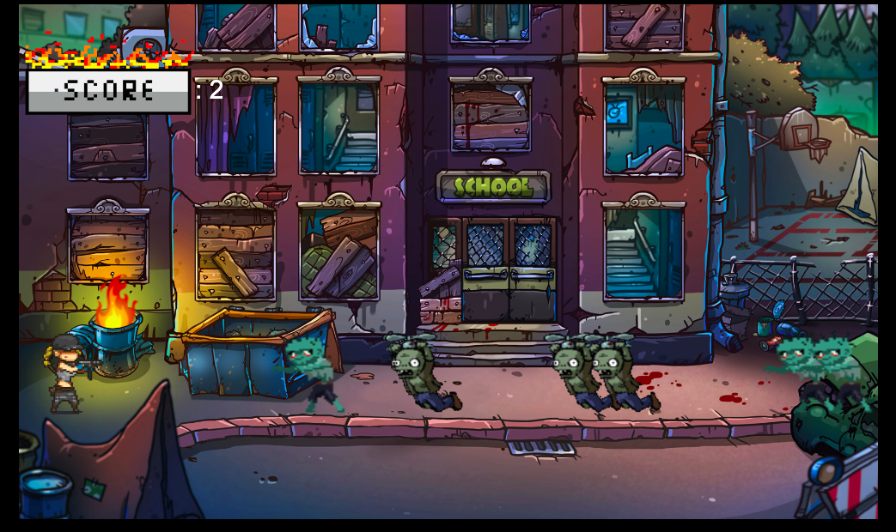

# Zombie Apocalypse

## Description

In this game the player is the last human being on Earth after a zombie apocalypse. He needs to survive killing all the zombies that are trying to eat his brain.

The purpose of this game is to score points killing zombies. The game will end after the player is killed by a zombie (just with one collision is enough).

## User stories MVP

Minimum user stories:

- User can see a start screen with instructions and an end screen with win/lose situation.
- User can move right and left.
- User can shoot and kill zombies.
- User can see a game screen where zombies appear randomly from the right and score points after killing them.
- User wins the game after killing the superboss.
- User loses when a zombie touches him.
- User loses when superboss touches him.

## User stories Backlog

- User can jump
- User can play different levels

## File structure

- <code>assets.js</code>: contains all the images and sounds for the game
- <code>player.js</code>: contains some of the elements for the player. Methods: moveLeft(), moveRight(), shoot()
- <code>enemies.js</code> contains some of the elements for the enemies. Methods: _runLeft()
- <code>bullets.js</code> contains some of the elements for the bullets. Methods: _shooting()
- <code>superboss.js</code> contains some of the elements for the superboss. Methods: _runLeft()
- <code>attackSB.js</code> contains some of the elements for the superboss attack. Methods: _fallDown()
- <code>superbossHealth.js</code> contains some of the elements for the superboss health. Methods: _fallDown()
- <code>game.js</code>: contains all the elements for the game to work. Methods: start(), \_update(),  _drawPlayer(), _generateEnemies(), _drawEnemies(), _drawBullets(), _generateAttackSB(), _drawAttackSB(), _checkCollissions(), _checkKills(), _generateSuperboss(), _drawSuperboss(), _generateSBHealth(), _drawSBHealth(), _writeScore(), _gameOver(), _winPage(), _assignControls(), _clean()
- <code>scripts.js</code>: contains all the DOM manipulation code to start the game

## Useful links

- [Presentation slides](https://slides.com/marcbs/zombeapocalypse)
- [Deployed game](https://marcbertansuarez.github.io/zombie-apocalypse-game/)
